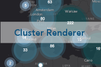
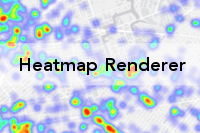
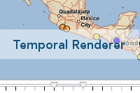
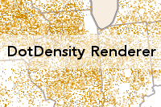
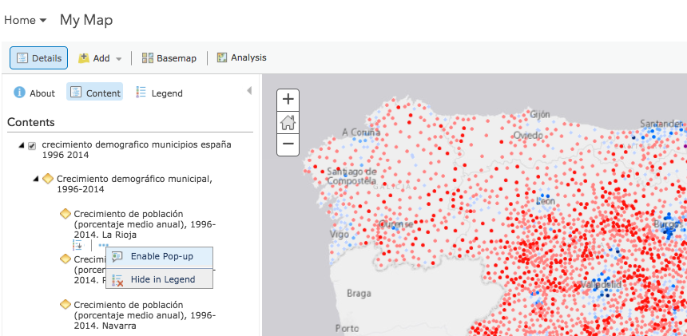
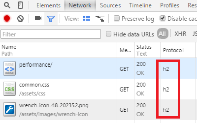

<!-- .slide: class="title" -->

## Grandes volúmenes de datos en ArcGIS
Marta Dávila ([@marta_davila](//twitter.com/marta_davila)) & Raúl Jiménez ([@hhkaos](//twitter.com/hhkaos))

[bit.ly/BigArcGIS](http://bit.ly/BigArcGIS)

---

<!-- .slide: class="section" -->

### Motivación

> Aprender a usar ArcGIS para crear aplicaciones capaces de consumir **grandes volúmenes de datos y sean usables**.

---

<!-- .slide: class="warning" -->

  **Aviso**:  
  Debido a la complejidad del tema algunos puntos se tocarán superficialmente, pero se dejarán enlaces a recursos para poder seguir ampliando

---

<!-- .slide: class="section" -->

### Claves del éxito

* Usabilidad:
  * Legibilidad de la información
  * Interactividad
  * Facilidad de uso
  * etc.

* Rendimiento:
  * Tiempos (de transferencia datos, de carga, ...)
  * Consumo de recursos (CPU, memoria & HD)
  * etc.

---

<!-- .slide: class="section" -->

### Algunos factores importantes

1. Tecnologías:
  * Cloud vs On-premise
  * Web vs Nativo

2. Naturaleza de la información:
  * Estática vs dinámica
  * Tipo: puntos vs líneas vs polígonos
  * Big data vs "small" data

3. Tráfico de usuarios

---

<!-- .slide: class="problems" -->

Legibilidad de la información

--

### Técnicas de visualización

* Agregaciones al vuelo y otros renderizadores 

 
<small>**Por ej:** la API JS de ArcGIS dispone de 12 renderizadores aunque no todos son válidos para todos los tipos de geometrías</small>

* Agregaciones precalculadas:
  * Mediante geoprocesamientos ([ver vídeo](https://youtu.be/rMwZTlFAeg8?t=13m53s))
  * Mediante consultas SQL ([ver vídeo](https://youtu.be/rMwZTlFAeg8?t=28m13s))
* Control de escala (p.e usando: [ScaleDependentRenderer](https://developers.arcgis.com/javascript/3/jssamples/renderer_proportional_scale_dependent.html))

--

### Agregación precalculada (ejemplo 1)

<iframe src="//hhkaos.github.io/youtube-embed-portion/?v=rMwZTlFAeg8&s=20m43s&e=20m55s&m=true" width="560" height="315"></iframe>

> Compartimentos hexagonales (hexabins) + control de escala  - [ver más](https://youtu.be/rMwZTlFAeg8?t=20m43s) -

--

### Agregación precalculada (ejemplo 2)

<iframe src="//hhkaos.github.io/youtube-embed-portion/?v=rMwZTlFAeg8&s=33m11s&e=33m21s&imgId=2&m=true" width="560" height="315"></iframe>

> Hexabins + **time slider**  - [ver más](https://youtu.be/rMwZTlFAeg8?t=33m11s) -

--

### Agregación precalculada (ejemplo 3)

<iframe src="//hhkaos.github.io/youtube-embed-portion/?v=rMwZTlFAeg8&s=52m09s&e=52m39s&imgId=3&m=true" width="560" height="315"></iframe>

> Hexabins + **definition queries**  - [ver más](https://youtu.be/rMwZTlFAeg8?t=52m09s) -

---

<!-- .slide: class="section" -->

## ArcGIS Online

[www.arcgis.com](http://www.arcgis.com)

`Servicio en la nube gestionado por Esri`

--

### Ventajas y limitaciones

* Ventajas:
  * Delegar la escalabilidad, estabilidad y seguridad
  * Almacenamiento: (sin límite)
    * Estático (archivos, teselas, etc): $0.12/GB/mes
    * Feature service: $24.5/GB/mes
  * Soporta: [feature layers](http://doc.arcgis.com/en/arcgis-online/share-maps/publish-features.htm),  [WFS layers](http://doc.arcgis.com/en/arcgis-online/share-maps/publish-wfs.htm),  [vector tile layers](http://doc.arcgis.com/en/arcgis-online/share-maps/publish-tiles.htm#ESRI_SECTION1_D7F82432E5DD479DA47B4C9DD657610E), [etc](http://doc.arcgis.com/en/arcgis-online/share-maps/hosted-web-layers.htm#ESRI_SECTION1_5E584527C2BE44BB848B875F47B0434A)
* Limitaciones (de ArcGIS Server Basic):
  * Sin geoprocesamientos
  * Sin dynamic layer
  * Sin GeoEvent server

---

<!-- .slide: class="section" -->

### Rendimiento con datos estáticos

--

## Teselas + popups

 
> [Asociar datos vectoriales (con popups) en capas de teselas](http://doc.arcgis.com/es/arcgis-online/create-maps/configure-pop-ups.htm#ESRI_SECTION2_6C6CD0DE9F9444D79AD4E097AE687DE1) - How to: [crear capas de teselas](http://doc.arcgis.com/es/arcgis-online/share-maps/publish-tiles.htm)

---

<!-- .slide: class="section" -->

## Rendimiento con datos dinámicos

--

### Datos tipo punto

Opciones para grandes volúmnes de puntos:

1. Control de escala con diferentes agregaciones 
o renderers (**recomendado**)
2. Capa de teselas + popup
3. Usar [Esri-Leaflet](https://github.com/Esri/esri-leaflet)

--

### Truco: datos tipo punto

Heatmap renderer con blur = 1 (ver: [web map](http://www.arcgis.com/home/webmap/viewer.html?webmap=8c80f5aa729f4a3cb8860f1431d4848a) / [JSON](http://www.arcgis.com/sharing/rest/content/items/8c80f5aa729f4a3cb8860f1431d4848a/data?f=json))

<iframe src="http://esri-es.github.io/JavascriptAPI/best-practices/morethan1000entities/points/jsapi_3_x_heatmaps.html" style="width:100%;height:500px; border:1px solid white"></iframe>

--

### Datos tipo línea/polígono

> Consejo: generalizar polígonos

Generalizar:
* [Mediante la API REST](http://tasks.arcgisonline.com/arcgis/rest/services/Geometry/GeometryServer/generalize) ([documentación](http://resources.arcgis.com/en/help/rest/apiref/index.html?generalize.html))
* [Al vuelo con la API de JS](https://blogs.esri.com/esri/arcgis/2011/06/13/feature-layers-can-generalize-geometries-on-the-fly/)

[Algoritmo de Douglas-Peucker](//en.wikipedia.org/wiki/Ramer%E2%80%93Douglas%E2%80%93Peucker_algorithm)

---

<!-- .slide: class="section" -->

### Datos en tiempo real

<iframe width="560" height="315" src="https://www.youtube.com/embed/-ldX7RPAkug" frameborder="0" allowfullscreen></iframe>

--

## Refresh o websockets

* [Set refresh interval](http://doc.arcgis.com/en/arcgis-online/create-maps/set-refresh-interval.htm)
* [WebSocket](https://developer.mozilla.org/en-US/docs/Web/API/WebSockets_API/Writing_WebSocket_client_applications)

---

<!-- .slide: class="section" -->

### ArcGIS Enterprise

---

### Tendencias

[<video src="videos/Animated3DMeshes.mp4" width="400" autoplay loop></video>](//coolmaps.esri.com/Dashboards/CrimeTrends/)
[<video src="videos/GPU.mp4" width="400" autoplay loop></video>](//youtu.be/rG-rw1ZJBDc?t=16m41s)

---

### Conclusión

El resultado dependerá principalmente de:

* La tecnología usada
* Las habilidades del equipo:
  * Desarrolladores (sobre rendimiento, la tecnología, ...)
  * Diseñadores (sobre diseño, UX, ...)
  * SysAdmin / devops (sobre DBMS, virtualización, ...)
  * etc.
* Presupuesto para hardware y/o software

---

<!-- .slide: class="agenda" -->

### Recursos

* [Awesome ArcGIS: ArcGIS Best Practices](https://esri-es.github.io/awesome-arcgis/arcgis/best-practices/performance/)
* [The Million Points on a Map Problem - Advanced Techniques](https://www.youtube.com/watch?v=rMwZTlFAeg8)
* [Drawing millions of features in ArcGIS: Advanced techniques](https://www.esri.com/training/catalog/57630434851d31e02a43ef39/drawing-millions-of-features-in-arcgis:-advanced-techniques/)
* [Esri 2017 Developer Summit Tech Sessions](https://www.youtube.com/playlist?list=PLaPDDLTCmy4Z844nQ0aFdRCTICoNDPf7E)
* [Structural and Sampling (JavaScript) Profiling in Google Chrome](https://www.youtube.com/watch?v=nxXkquTPng8)

---

<!-- .slide: class="centered" -->

## Questions?

* Marta Dávila: marta.davida@esri.es
* Raúl Jiménez: raul.jimenez@esri.es

Slides: [bit.ly/BigArcGIS](http://bit.ly/BigArcGIS)

---

<!-- .slide: class="end" -->
#
