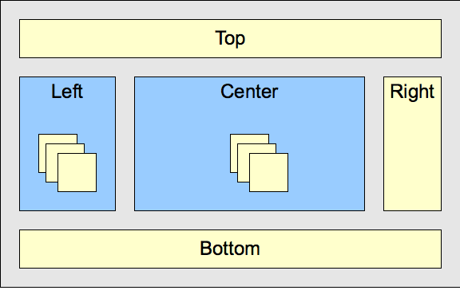

<!-- .slide: class="title" -->

## Geoquake: Widgets
Carlos Herrera ([@MundoGister](https://twitter.com/MundoGister))

Raúl Jiménez ([@hhkaos](https://twitter.com/hhkaos))

[bit.ly/DojoGoodParts](http://bit.ly/DojoGoodParts)

---

<!-- .slide: class="problems" -->

## Historias

* 1993 - 1999:  Nada
* 1999: AJAX (IE5, Netscape, Opera, Konqueror, ...)
* 2001 - 2005:  Flash por todos lados (acceso a la cam, micro), muchos hacks
* 2006 - 2009
* 2010 - Hoy -> Boom!

---


---

### Dojo Already did that

<div style="position:relative;height:0;padding-bottom:56.25%"><iframe src="https://www.youtube.com/embed/BY0-AI1Sxy0?ecver=2" width="640" height="360" frameborder="0" style="position:absolute;width:70%;height:70%;left:50%;margin-left:-35%;" allowfullscreen></iframe></div>

> [JSConfUS 2013 Peter Higgins: #dadt (Dojo already did that)](https://www.youtube.com/watch?v=BY0-AI1Sxy0&t=569s)

---

### Introducción Dojo Toolkit

--

### Antecedentes
   * Alex Russell lo empezó en 2004
   * Comunidad muy activa en el proyecto
   * En 2005 contribuciones > equipo de desarrolladores
   * Empresas que usan Dojo: Cisco, IBM, Esri, etc.

--

 * [dojo](https://dojotoolkit.org/reference-guide/1.10/dojo/index.html#dojo-index) - Core. Tiene distintas funcionalidades (manipular DOM, llamadas AJAX, etc)
 * [dijit](https://dojotoolkit.org/reference-guide/1.10/dijit/index.html#dijit-index) - Interfaces de usuario
 * [dojox](https://dojotoolkit.org/reference-guide/1.10/dojox/index.html#dojox-index) - Funcionalidad basada en los módulos anteriores
 * [utils](https://dojotoolkit.org/reference-guide/1.10/util/index.html#util-index) - Herramientas de apoyo

--

### Primeros pasos

  * CDN: <br>&lt;script src="//ajax.googleapis.com/ajax/libs/dojo/1.10.4/dojo/dojo.js"&gt;&lt;/script&gt;
  * `define` y `require`
  * [Hola Mundo!](https://github.com/MundoGister/Seminario_Dojo/blob/gh-pages/holamundo_dojo.html)

--

### Animaciones y efectos

   * Animaciones y efectos `dojo/_base/fx`

```
require(
  ["dojo/_base/fx", "dojo/on", "dojo/dom", "dojo/domReady!"],
  function(fx, on, dom) {
    var fadeOutButton = dom.byId("fadeOutButton"),
        fadeInButton = dom.byId("fadeInButton"),
        fadeTarget = dom.byId("fadeTarget");

    on(fadeOutButton, "click", function(evt){
        fx.fadeOut({ node: fadeTarget }).play();
    });
    on(fadeInButton, "click", function(evt){
        fx.fadeIn({ node: fadeTarget }).play();
    });
  }
);
```
[Ejemplo en funcionamiento](https://mundogister.github.io/Seminario_Dojo/effects/fade.html)

--

### Efectos

```
require(
  ["dojo/_base/fx", "dojo/on", "dojo/dom", "dojo/domReady!"],
  function(baseFx, on, dom) {
    var startButton = dom.byId("startButton"),
    reverseButton = dom.byId("reverseButton"),
    borderbox = dom.byId("borderbox");

    // Establecemos el controlador on
    on(startButton, "click", function(evt){
      baseFx.animateProperty({
        node: borderbox,
        properties: { borderWidth: 100 }
      }).play();
    }
  }
);
```

[Ejemplo en funcionamiento](https://mundogister.github.io/Seminario_Dojo/effects/animateBorder.html)

--

### Combinar

```
function swapAnim(node1, node2) {
  var posn1 = parseInt(domStyle.get(node1, "left")),
  posn2 = parseInt(domStyle.get(node2, "left"));

  return moveNodes = fx.combine([
    fx.slideTo({
      duration: 1200,
      node: node2,
      left: posn1
    }),
    fx.slideTo({
      duration: 1200,
      node: node1,
      left: posn2
      })
      ]);
    }
  ]);
```

--

### Combinar (2)

```
on(swapButton, "click", function(evt){

  // chain the swap nodes animation
  // with another to fade out a background color in our container
  var anim = fx.chain([
    swapAnim(c1, c2),
    baseFx.animateProperty({
      node: container,
      properties: {
        backgroundColor: "#fff"
      }
    })
  ]);

  // before the animation begins, set initial container background
  aspect.before(anim, "beforeBegin", function(){
    domStyle.set(container, "backgroundColor", "#eee");
  });

  // when the animation ends, toggle the originalOrder
  on(anim, "End", function(n1, n2){
    originalOrder = !originalOrder;
  });

  anim.play();
});
```

[Ejemplo en funcionamiento](https://mundogister.github.io/Seminario_Dojo/effects/combine_chain.html)

--

### Dijit

`dojo/parser` es un módulo opcional que se utiliza para convertir los nodos "decorados" en el DOM y convertirlos a dijits.
```
var dojoConfig = { parseOnLoad: true }

```

--

`dijit/layout` proporciona una serie de elementos para organizar nuestra interfaz.
   * `dijit/layout/BorderContainer`
   * `dijit/layout/ContentPane`
   * `dijit/layout/AccordionContainer`
   * `dijit/layout/AccordionPane`
   * `dijit/layout/LayoutContainer`
   * `dijit/layout/StackContainer`
   * `dijit/layout/TabContainer`

--



[Layout blocks](https://dojotoolkit.org/reference-guide/1.10/_images/layoutBlock.png)


--

### Forms

* [Botones](https://mundogister.github.io/Seminario_Dojo/dijit/form/buttons.html)
   * `dijit.form.Button`
   * `dijit.form.DropDownButton`
   * `dijit.form.ComboButton`
   * `dijit.form.ToggleButton`

* [Entrada de texto](https://mundogister.github.io/Seminario_Dojo/dijit/form/text_areas.html)
   *  `dijit.form.SimpleTextarea`
   *  `dijit.form.Textarea`

--

### Forms (2)

* [Selectores](https://mundogister.github.io/Seminario_Dojo/dijit/form/select_widgets.html)
   *  `dijit.form.Select`
   *  `dijit.form.ComboBox`
   *  `dijit.form.MultiSelect`
   *  `dijit.form.FilteringSelect`   

* [Varios](https://mundogister.github.io/Seminario_Dojo/dijit/form/Form.html)
   * `dijit.form.Form`
   * `dijit.form.HorizontalSlider`
   * `dijit.form.VerticalSlider`
   * `dijit.form.CheckBox`
   * `dijit.form.RadioButton`
   * `dijit.form.DataList`

---

### Equivalencias: Vanilla <-> jQuery <-> Dojo

[](https://github.com/esri-es/iniciacion-a-dojo/tree/master/recursos/cheatsheet)

[Chuleta o cheatsheet](http://porkteinspira.com/wp-content/uploads/2014/08/pork_chuleta_updated.png)

--

### Declarar un módulo - [Live](http://esri-es.github.io/iniciacion-a-dojo/tutoriales/declarar-un-modulo/) - [Doc](https://github.com/esri-es/iniciacion-a-dojo/tree/master/tutoriales/declarar-un-modulo/)

```js
define([
    'dojo/dom',
    'dojo/fx'
  ],function(dom,fx){
    return {
      html: function(id, value){
        dom.byId(id).innerHTML = value;
      },
      get: function(id){
        return dom.byId(id).innerHTML;
      },
      move: function(id, top, left){
        fx.slideTo({
          node: id,
          top: top,
          left: left
        }).play();
      }
    };
  });
```

--

### Declarar un widget - [Live sample](http://esri-es.github.io/iniciacion-a-dojo/tutoriales/declarar-un-widget/) - [Doc](https://github.com/esri-es/iniciacion-a-dojo/tree/master/tutoriales/declarar-un-widget)

```js
define([
  "dojo/_base/declare",
  "dojo/dom-construct",
  "dijit/_WidgetBase"
  ],function(declare, domConstruct, _WidgetBase){

    return declare([_WidgetBase], {

      constructor: function(opt){
          this._i = opt.init || 0;

          if(!opt.id){
            console.error("Debes especificar un id del elemento");
            return -1;
          }
          this._id = opt.id;
      },

      buildRendering: function(){
        // create the DOM for this widget
        this.domNode = domConstruct.create("button", {innerHTML: this._i});
        domConstruct.place(this.domNode, this._id);
      },

      postCreate: function(){
        // every time the user clicks the button, increment the counter
        this.connect(this.domNode, "onclick", "increment");
      },

      increment: function(){
        this.domNode.innerHTML = ++this._i;
      }

    });
});
```

--

### Uso de Dojo en ArcGIS

* [Carga una capa](https://developers.arcgis.com/javascript/latest/sample-code/sandbox/index.html?sample=layers-featurelayer) (ni rastro de Dojo)
* [Scene goTo](https://developers.arcgis.com/javascript/latest/sample-code/sandbox/index.html?sample=scene-goto) (dojo/query, dojo/on)

--

## AMD, CommonJS & ES2015

* **AMD**: require.js & Dojo
* **CommonJS**: Webpack, browserify, Node.js
* **ES2015**: Babel, polyfills.

> Blog post: [CommonJS vs AMD vs ES2015](https://auth0.com/blog/javascript-module-systems-showdown/)

--

## Dojo declarative syntax

Data-dojo-* ([2012](https://www.sitepen.com/blog/2012/01/19/html5-data-dojo-attribute-support/)):

```html
<div
    data-dojo-type="foo.bar.baz"
    data-dojo-props='title:"My Dialog", ...'>
</div>
```

HTML5:

```html
<div data-title="My Dialog"></div>
```

--

## Dojo 2

* [Typescript](https://www.typescriptlang.org/) (como Angular 2)
* [PostCSS](http://postcss.org/)
* [Widget](https://github.com/dojo/widget-core) + state & [exportable](https://github.com/dojo/widget-core/commit/137d28ffc98c556d017dbbc1c9344025a7acb691) to Web Components

> [Intro to Dojo2 with ArcGIS API for JavaScript](http://odoe.net/blog/intro-dojo2-arcgis-api-javascript/)

---

<!-- .slide: class="centered" -->

## ¿Preguntas?

* Raúl Jiménez: raul.jimenez@esri.es

* Carlos Herrera: carlos.herrera@esri.es

[bit.ly/DojoGoodParts](http://bit.ly/DojoGoodParts)

---

<!-- .slide: class="end" -->
#
