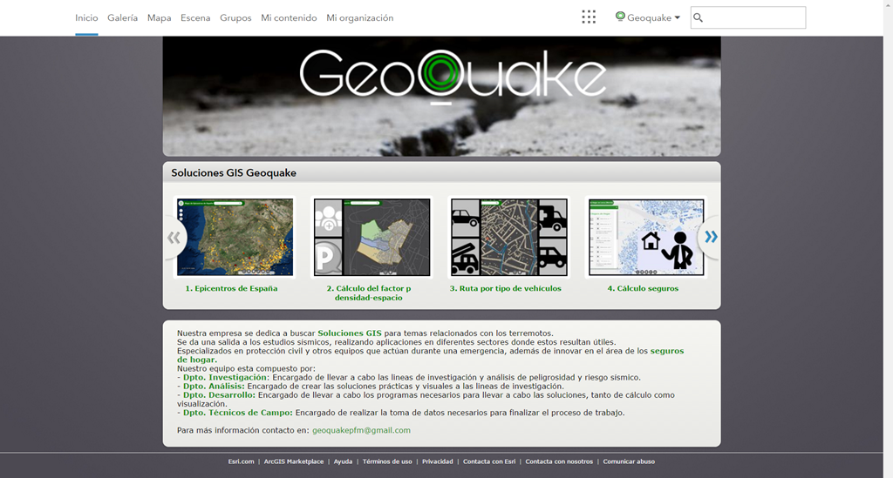
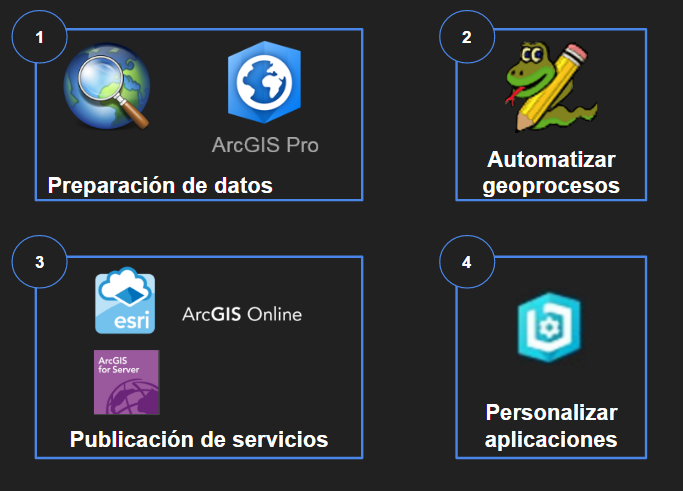

<!-- .slide: class="title" -->

## Soluciones GIS Geoquake

Proyecto Final de Máster 2017

Slides : [https://github.com/Geo-Developers/talks/tree/master/slides](https://goo.gl/BzIZ9k)

---

<!-- .slide: class="section" -->

### Objetivos de este año

- Crear una organización
- Aplicaciones con soluciones GIS

--

<!-- .slide: class="section" -->


Empresa ficticia que realiza estudios de ingeniería sísmica.

Se pretende:
- Dar visibilidad a este campo
- Presentar posibles soluciones con los resultados obtenidos y utilizando la tecnología adecuada

--

<!-- .slide: class="section" -->

### Presentación

[](https://youtu.be/I8-m7GkOcso "Soluciones GIS Geoquake")

Realizado por:
[Andrea Martín](https://www.linkedin.com/in/monica-martigomez/) |
[Monica Martí](https://www.linkedin.com/in/anmaro13/) |
[Leticia Matas](https://www.linkedin.com/in/matasalvarezleticia/)

---

<!-- .slide: class="section" -->

## Desarrollo del Proyecto

--

<!-- .slide: class="section" -->

### Datos de partida

* Registro de datos del [Grupo de Investigación de Ingeniría Sísmica (GIIS) - Escuela de Topografía (UPM) ](http://grupos.topografia.upm.es/sismo/)

* Sección censal del portal de ["Datos abiertos de Lorca"](http://datos.lorca.es/catalogo/)

* Viario de la ciudad de ["CartoCiudad"](http://www.cartociudad.es/visor/)

--

<!-- .slide: class="section" -->

### Herramientas utilizadas


- ArcMap - ArcPro
- PyScripter
- ArcGIS Server
- Web AppBuilder

--

<!-- .slide: class="section" -->

### Flujo de trabajo



--

<!-- .slide: class="section" -->

### Publicación de los servicios

* ArcGIS Server
* Desde la conexión Pública
* Capas editables publicadas como Feature Service
* Capas de información como Map Service
* Herramientas de geoprocesos publicados como GPService
	* Desde la ventana de resultados

--

<!-- .slide: class="section" -->

## Arquitectura y versionado

Utilizada para la aplicación del cálculo del seguro y la aplicación del estado de los edificios, con el fin de actualizar la información del daño generado trás un terremoto a las aseguradoras.

* BBDD Corporativa
  * Crear Enterprise GDB
  * Versionado: Actualización del estado de los edificios
  	* Versión default: Aplicación de Seguros
  	* Versión techfield: Para que pueda actualizar el daño generado post-evento.
  * SQL Server Manager
  	* Crear usuario con permisos de edición

--

<!-- .slide: class="section" -->

## Geoprocesamientos

* Scripts de python:

  * Calculo del factor p densidad - espacio
  * Cáculo de rutas
  * Cálculo del Seguro

--

<!-- .slide: class="section" -->

### Cálculo del factor p

Automatización del cálculo del factor p, que relaciona la densidad de población con el espacio.


--

<!-- .slide: class="section" -->


### Cálculo de rutas

Recalcula la ruta según la cantidad de escombros generados trás un terremoto.
Se crean además cuatro tipos de restricciones para cada tipo de vehículo considerado:
- Vehículo normal
- Todoterreno
- Ambulancia
- Camión de bomberos

--

<!-- .slide: class="section" -->


### Cálculo del seguro

Realiza el cálculo del seguro teniendo en cuenta los diversos factores que introduce el usuario y la peligrosidad del terreno.


---

  <!-- .slide: class="section" -->

## Personalización del portal

Se cambia la presentación del portal con un aspecto más corporativo.


---

<!-- .slide: class="section" -->

## Personalización de las aplicaciones


---

<!-- .slide: class="section" -->

### Integración de Bootstrap en Web AppBuilder


https://github.com/tomwayson/web-appbuilder-bootstrap


--

### Archivos necesarios

* index.html
* init.js


--

### Requires


---

<!-- .slide: class="section" -->

## Desarrollo de los widgets

---

<!-- .slide: class="section" -->

## Widget de Cálculo de Seguros
[Demo]()


--

## Widget de Cálculo de Seguros

* Estableciendo los settings
	

--

### Settings del Cálculo de Seguros

* Crear html
* getConfig (Almacenar parámetros)
* setConfig (parámetros durante setting)


--

### Settings del Cálculo de Seguros

* Interfaz de Configuración:
  - Left-Panel
  - Central-Panel

--

### HTML

 * Left-Panel

```HTML
<fieldset class="well-left form-horizontal">
	<div class="form-group">
		<div class="collapse">
				<button class="btn btn-primary" data-dojo-attach-event="onclick: onClick_Descripcion" data-dojo-props="title: 'Descripción'" type="button">Descripción</button>
				<div class="panelbody" data-dojo-type="dijit/TitlePane" data-dojo-props="title: 'Parámetros de Entrada'">
						<button class="btn obli" data-dojo-attach-event="onclick: onClick_Anio">
								<label class= "control-label">Año de comienzo de la póliza</label>
						</button>
						...		 
				</div>
				<div class = "panelbody" data-dojo-type="dijit/TitlePane" data-dojo-props="title: 'Salida'">
            <button id="salida" class="btn btn-primary" data-dojo-attach-event="onclick: onClick_Salida">
                 <label class= "control-label">Capa de Salida</label>
            </button>
        </div>
			</div>
		</div>
</fieldset>

```
--
### HTML

 * Central-Panel
 	- Interfaz de Descripción del widget

```HTML
<fieldset class="well-left form-horizontal">
	<div class="form-group" id="interfacedescription">
    <h4 class="contact-subtitle-1" id="title"><i class="fa fa-map"></i>&nbsp;   Finalidad</h4>
    <p>Cálculo del Seguro de Hogar</p>
    <h4 class="contact-subtitle-1"><i class="fa fa-file-text-o" aria-hidden="true"></i>&nbsp; Descripción</h4>
    <p>El objetivo del widget es obtener el valor de la prima de Seguro de Hogar anual, teniendo en cuenta el factor de peligrosidad
    de los edificios ante una catástrofe natural </p>
  </div>
	...
</fieldset>
```

--
### HTML

* Central-Panel
	- Interfaces de los parámetros de entrada. Diferenciamos entre parámetros obligatorios y opcionales mediante un * .

--
### HTML

* Central-Panel/Parámetro Obligatorio

```HTML
<fieldset class="well-left form-horizontal">
	<div class="form-group" id="interfaceanio">
      <label class="col-md-6 control-label">Etiqueta: </label>
      <div class="col-md-6 inputGroupContainer">
          <div class="input-group">
              <input class="form-control" type="text" data-dojo-attach-point="insyear">
          </div>
      </div>
      <label class="col-md-6 control-label">Información: </label>
      <div class="col-md-6 inputGroupContainer">
          <div class="input-group">
              <input class="form-control" type="text" data-dojo-attach-point="infoinsyear">
          </div>
      </div>
      <label  class="col-md-6 control-label">Valor Predeterminado:</label>
      <div class="col-md-6 inputGroupContainer">
          <div class="input-group">
              <select class="form-control selectpicker" data-dojo-attach-point="valueinsyear">
                  <option value="0" >Selecciona un año</option>
                  <option value= "2015">2015</option>
                  <option value = "2016">2016</option>
                  <option value= "2017">2017</option>
              </select>
          </div>
        </div>
    </div>
 ...
</fieldset>
```
--
### HTML

* Central-Panel/Parámetro Opcional

```HTML
<fieldset class="well-left form-horizontal">
	<div class="form-group" id="interfacetemporal">

			...

			<label class="col-md-6 control-label">Visible: </label>
			<div class="col-md-6 inputGroupContainer">
					<div class="input-group">
						 <div class="onoffswitch">
								<input type="checkbox" name="onoffswitch" class="onoffswitch-checkbox" id="visitempo" data-dojo-attach-point="visibletemp" checked hidden>
								<label class="onoffswitch-label" for="visitempo"><span class="onoffswitch-inner"></span><span class="onoffswitch-switch"></span></label>
								</div>
						</div>
				</div>
				<label class="col-md-6 control-label">Valor Predeterminado: </label>
								<div class="col-md-6 inputGroupContainer move">
										<div class="input-group">
											<div class="radio-inline">
													<label>
															<input type="radio" name="inhabitabilidad" id = "temporal" value="true" data-dojo-attach-event="onclick:temporal" data-dojo-attach-point="covtempo"/> Si
													</label>
											</div>
											<div class="radio-inline">
													<label>
															<input type="radio" name="inhabitabilidad" id = "temporal1" value="false" data-dojo-attach-event="onclick:temporal" checked data-dojo-attach-point="covtemporal"/> No
													</label>
											</div>
										</div>
								</div>
								<label class="col-md-6 control-label">Valor de la cobertura: </label>
								<div class="col-md-6 inputGroupContainer">
										<div class="input-group">
											<select name="temporal" class="form-control selectpicker" id="coberturetemporal" disabled data-dojo-attach-point="valuetemporalcoverage">
											 <option value="0" >Selecciona un valor</option>
											 <option value="1000">1.000€</option>
											 <option value="5000">5.000€</option>
											 <option value="10000">10.000€</option>
											 <option value="20000">20.000€</option>
											</select>
										</div>
								</div>
						</div>
 ...
</fieldset>
```
--
#### Establecer los parámetros

* getConfig

	* Parámetros del servicio
	* Parámetros de la tabla
	* Parámetros de los desplegables

--

--
#### setConfig

En caso de tener la configuración a medias, grandes proyectos

```JavaScript
setConfig: function(config) {
	this.config = config;
	var options = config.inPanelVar.params;
	// Load service URL if exisits
	if (options && options.serviceUrl) {
	    this.serviceUrl.set('value', options.serviceUrl);
	};
	return this.config;
	},
```

--

### Parámetros de entrada:

* Año comienzo de la poliza
* Tipo de edificio
* Año de construcción
* Superficie de la vivienda
* Peligrosidad
* Tipo de material
* Número de pisos
* Valor de mercado
* Deductible
* ¿Cobertura de objetos frágiles?
* ¿Cobertura de bienes personales?
* Valor de cobertura de bienes personales
* ¿Cobertura por inhabitabilidad temporal?
* Valor de cobertura de inhabitabilidad temporal
* ¿Es cliente nuestro?
* Tipo de seguro contratado


--


### HTML

* Form-group with select:

```HTML
<!-- Año de Poliza-->

 <div class="form-group">
		<label class="col-md-6 control-label" title="${config.infoiyear}">${config.iyear}</label>
		<div class="col-md-6 selectContainer">
			<div class="input-group">
				<span class="input-group-addon"><i class="glyphicon glyphicon-list"></i></span>
				<select name="poliza" id ="anio" class="form-control selectpicker" title="${config.valueiyear}" >
						<option value="0" >Selecciona un año</option>
						<option id="2015" value="2015">2015</option>
						<option id="2016" value="2016">2016</option>
						<option id="2017" value="2017">2017</option>
				</select>
			</div>
		</div>
 </div>  
```

--

* Form-group with text type input :


```HTML
<!-- Año construccion-->

	<div class="form-group">
		 <label class="col-md-6 control-label" title="${config.infocyear}">${config.cyear}</label>
		 <div class="col-md-6 inputGroupContainer">
				<div class="input-group">
					<span class="input-group-addon"><i class="glyphicon glyphicon-home"></i></span>
					<input name="anio" id ="construccion" placeholder="Introduce un año" max="2014" min="1800" class="form-control" type="text" pattern="/[1][8|9][0-9][0-9]|[2][0][1][4]/" value="${config.valuecyear}">
				</div>
				<p class="help-block">${config.helpcyear}</p>
			</div>
	</div>
```

--

* Form-group with radio type input:


```HTML
<!-- Cobertura objetos fragiles -->

  <div class="form-group" id="${config.visobj}">
     <label class="col-md-6 control-label" title="${config.infoobject}">${config.objecttext}</label>
      <div class="col-md-6">
         <div class="radio-inline">
              <label>
                  <input type="radio" name="objetos" id="objetos" ${config.object} value="true" /> Si
              </label>
          </div>
          <div class="radio-inline">
              <label>
                  <input type="radio" name="objetos" id="objetos1" ${config.objection} value="false"/> No
              </label>
          </div>
      </div>
  </div>
```

--

### HTML

#### Botones:

* Siguiente

```HTML
<!-- Button -->
	<div class="form-group">
			<label class="col-md-6 control-label">
				 <div></div>
			</label>
			<div class="col-md-6">
					<button id="next" class="btn btn-primary" data-dojo-attach-event="onclick:change"><span class="glyphicon glyphicon-play-circle"></span> Siguiente
					</button>
			</div>
	</div>
  ....
```

--

* Anterior & Ejecutar

```HTML
<!-- Button -->
	<div class="form-group">
			<label class="col-md-6 control-label">
         <div></div>
      </label>
			<div class="col-md-6">
					<button id="before" class="btn btn-primary" data-dojo-attach-event="onclick:change"><span class="glyphicon glyphicon-play-circle"></span> Anterior
					</button>
					<button id="hotspotButton" class="btn btn-primary" data-dojo-attach-event="onclick:calcularseguro"><span class="glyphicon glyphicon-play-circle"></span> Ejecutar </button>
			</div>
	</div>
```

--

### JavaScript

Ciclo de vida del widget

```JavaScript

	postCreate: function() {
		...
	},
	startup: function() {
		...
	},
	onOpen: function() {
		...
	},
	onClose: function() {
		...
	}
```

--

### JavaScript

Startup: Creamos el Geoproceso

```JavaScript
   	startup: function() {
			var gpServiceUrl = "https://localhost:6443/arcgis/rest/services/Aseguradora/GPSeguros/GPServer/ScriptEdificios";
		    this.gp = new Geoprocessor(gpServiceUrl);

	      ...
    	},
```

--

### JavaScript

Otras funciones definidas:
 * Función que define los parámetros del cálculo del seguro

	```JavaScript

 		calcularseguro:function(){
 		...
         },
	```

--

### JavaScript

Otras funciones definidas:
 * Función que te permite recoger el resultado del geoproceso y pintarlo 	en el mapa
 * Función para conocer el estado del geoproceso
 * Función que en caso de que el servicio de geoproceso de error manda un mensaje alertando al usuario

 ```JavaScript

 	gpJobComplete:function(){
 	...
     },
	 gpJobStatus:function(){
	 ...
	 },
	 gpJobFailed:function(){
	 ...
	 },

 ```

--

### JavaScript

Otras funciones definidas:
 * Función para hacer visible/no visible las interfaces en las que se ha dividido el formulario


 ```JavaScript

 	change:function(){
 	...
     },

```

--

### JavaScript

Otras funciones definidas:
 * Función para habilitar/deshabilitar el campo correspondiente al valor de la cobertura de bienes personales en función de si deseo o no dicha covertura
 * Función para habilitar/deshabilitar el campo correspondiente al valor de la cobertura por inhabitabilidad temporal en función de si deseo o no dicha cobertura
 * Función para habilitar/deshabilitar el campo correspondiente al tipo de seguro contratado en función de si el usuario desea que el análisis se produzca en edificios donde existen clientes de la compañia.


 ```JavaScript

 	bienes:function(){
 	...
     },
	 temporal:function(){
	 ...
	 },
	 cliente:function(){
	 ...
	 },

```

--

### JavaScript

Otras funciones definidas:
  * Función para limpiar los resultados dibujados en el mapa y los mensajes del estado del geoproceso


  ```JavaScript

  	cleanup:function(){
  	...
      },

  ```

--


<!-- .slide: class="end" -->


---


<!-- .slide: class="questions centered" -->

## Contacto

**Andrea**
* GitHub : [anmaro13](https://github.com/anmaro13)
* Linkedin: [Andrea Martín Rodríguez](https://www.linkedin.com/in/anmaro13)

**Leticia**
* GitHub : [aicelm](https://github.com/aicelm)
* Linkedin: [Leticia Matas Álvarez](https://www.linkedin.com/in/matasalvarezleticia)
* Twitter: [aicel_m](https://twitter.com/aicel_m)

---


<!-- .slide: class="end" -->
