<!-- .slide: class="title" -->

## Soluciones GIS Geoquake

Proyecto Final de Máster 2017

Slides : [https://github.com/Geo-Developers/talks/tree/master/slides](https://goo.gl/BzIZ9k)

---

<!-- .slide: class="section" -->

## Presentaciones

|||
|:---:|:---:|
|||
|[**Andrea Martín Rodriguez**](https://www.linkedin.com/in/anmaro13)|[**Leticia Matas Álvarez**](https://www.linkedin.com/in/matasalvarezleticia)|
|Grado en Ingeniera del Medio Natural|Ingeniería técnica en Topografía|

Ambas realizando las prácticas en el **Dpto. de Técnología e Inovación** trás cursar el **Máster GIS de ESRI**


---

## Objetivos de este año

- Crear una organización
- Aplicaciones con soluciones GIS

--

<!-- .slide: class="section" -->


Empresa ficticia que realiza estudios de ingeniería sísmica.

Se pretende:
- Dar visibilidad a este campo
- Presentar posibles soluciones con los resultados obtenidos y utilizando la tecnología adecuada

--

<!-- .slide: class="section" -->

### Presentación del proyecto

[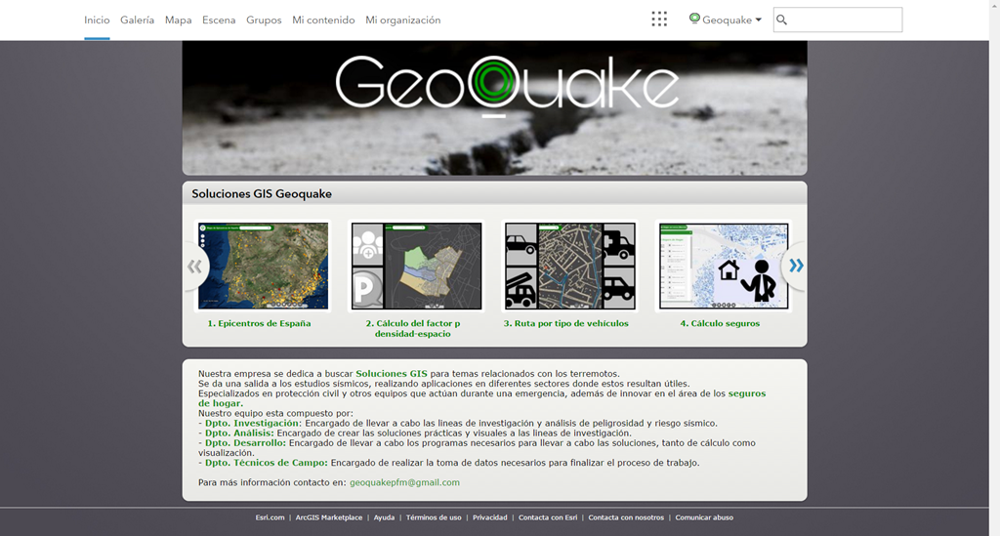](https://youtu.be/I8-m7GkOcso "Soluciones GIS Geoquake")

Realizado por:
[Andrea Martín](https://www.linkedin.com/in/monica-martigomez/) |
[Monica Martí](https://www.linkedin.com/in/anmaro13/) |
[Leticia Matas](https://www.linkedin.com/in/matasalvarezleticia/)

---

<!-- .slide: class="section" -->

## Desarrollo del Proyecto

--

<!-- .slide: class="section" -->

### Datos de partida

* Registro de datos del [Grupo de Investigación de Ingeniría Sísmica (GIIS) - Escuela de Topografía (UPM) ](http://grupos.topografia.upm.es/sismo/)

* Sección censal del portal de ["Datos abiertos de Lorca"](http://datos.lorca.es/catalogo/)

* Viario de la ciudad de ["CartoCiudad"](http://www.cartociudad.es/visor/)

--

<!-- .slide: class="section" -->

### Herramientas utilizadas

- ArcMap - ArcPro
- PyScripter
- ArcGIS Server
- Web AppBuilder

--

<!-- .slide: class="section" -->

### Flujo de trabajo

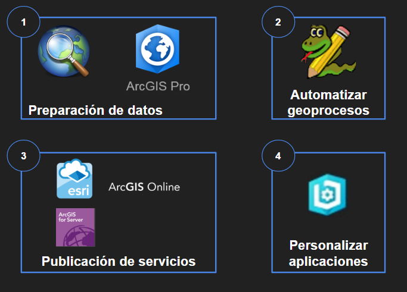

--

<!-- .slide: class="section" -->

### Publicación de los servicios

* ArcGIS Server
* Capas editables publicadas como Feature Service
* Capas de información como Map Service
* Herramientas de geoprocesos publicados como GPService
	* Desde la ventana de resultados

--

<!-- .slide: class="section" -->

### Arquitectura y versionado

Utilizada para la aplicación del cálculo del seguro y la aplicación del estado de los edificios, con el fin de actualizar la información del daño generado trás un terremoto a las aseguradoras.

* BBDD Corporativa
  * Crear Enterprise GDB
  * Versionado: Actualización del estado de los edificios
  	* Versión default: Aplicación de Seguros
  	* Versión techfield: Para que pueda actualizar el daño generado post-evento.
  * SQL Server Manager
  	* Crear usuario con permisos de edición

---

<!-- .slide: class="section" -->

## Geoprocesamientos

* Scripts de python:

  * Calculo del factor p densidad - espacio
  * Cáculo de rutas
  * Cálculo del Seguro

--

<!-- .slide: class="section" -->

### Cálculo del factor p

Automatización del cálculo del factor p, que relaciona la densidad de población con el espacio.


--

<!-- .slide: class="section" -->


### Cálculo de rutas

Recalcula la ruta según la cantidad de escombros generados trás un terremoto.
Se crean además cuatro tipos de restricciones para cada tipo de vehículo considerado:
- Vehículo normal
- Todoterreno
- Ambulancia
- Camión de bomberos

--

<!-- .slide: class="section" -->

### Cálculo del seguro

Realiza el cálculo del seguro teniendo en cuenta los diversos factores que introduce el usuario y la peligrosidad del terreno.

---

<!-- .slide: class="section" -->

## Personalización del portal

Se cambia la presentación del portal con un aspecto más corporativo.

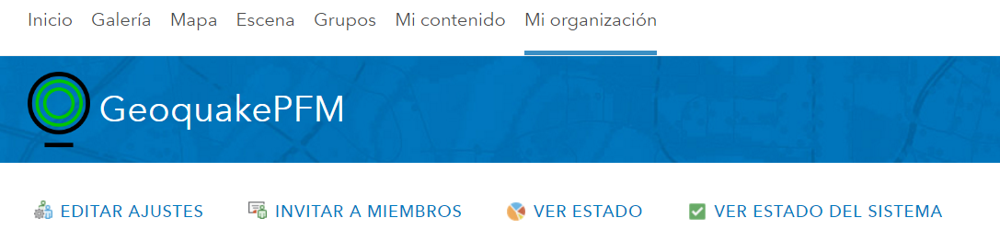

--

### Personalización del portal
#### Página de Inicio

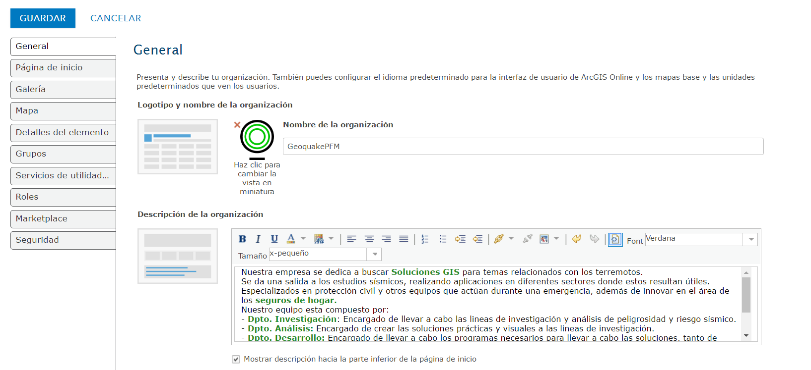

Editamos la descripción de nuestra portada, con datos de la empresa.

--

### Personalización del portal
#### Página de Inicio | Código

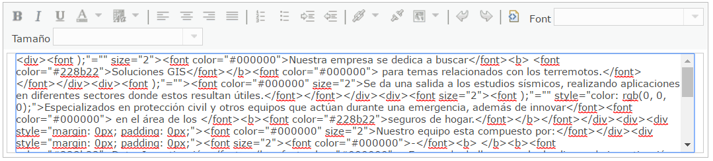

--

### Personalización del portal
#### Galería

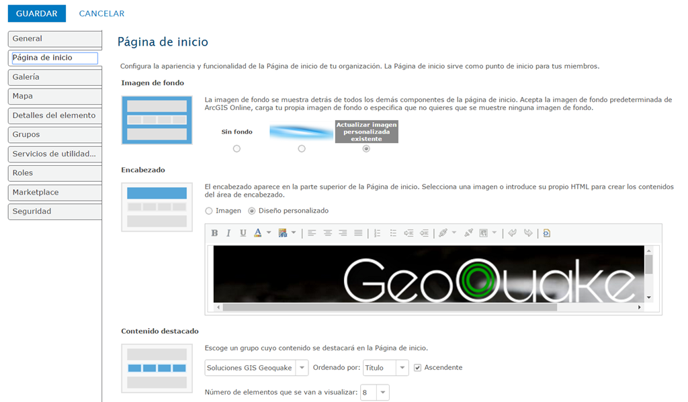

Editamos la imagen y el estilo de la página

--

### Personalización del portal
#### Galería | Código

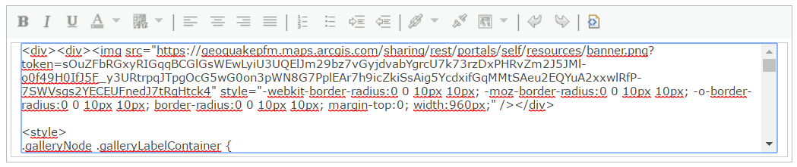

---

<!-- .slide: class="section" -->

## Personalización de las aplicaciones


--

<!-- .slide: class="section" -->

### Integración de Bootstrap en Web AppBuilder


https://github.com/tomwayson/web-appbuilder-bootstrap

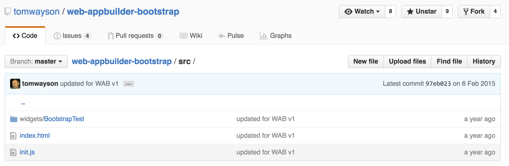

--

### Archivos necesarios

* index.html
* init.js

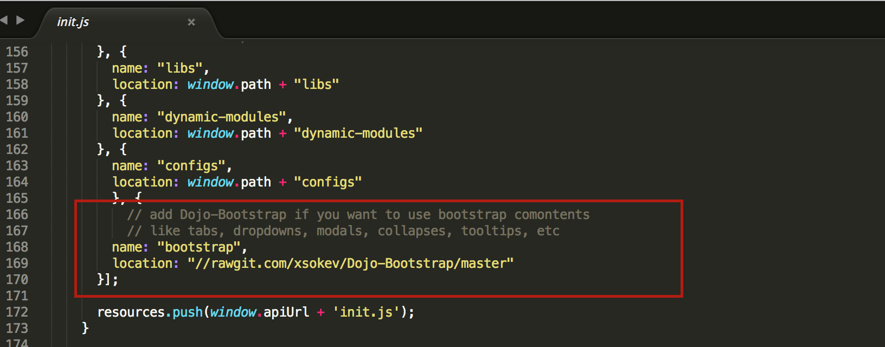

--

### Requires


---

<!-- .slide: class="section" -->

## Desarrollo de los widgets

---

<!-- .slide: class="section" -->

## Widget Radio de búsqueda
[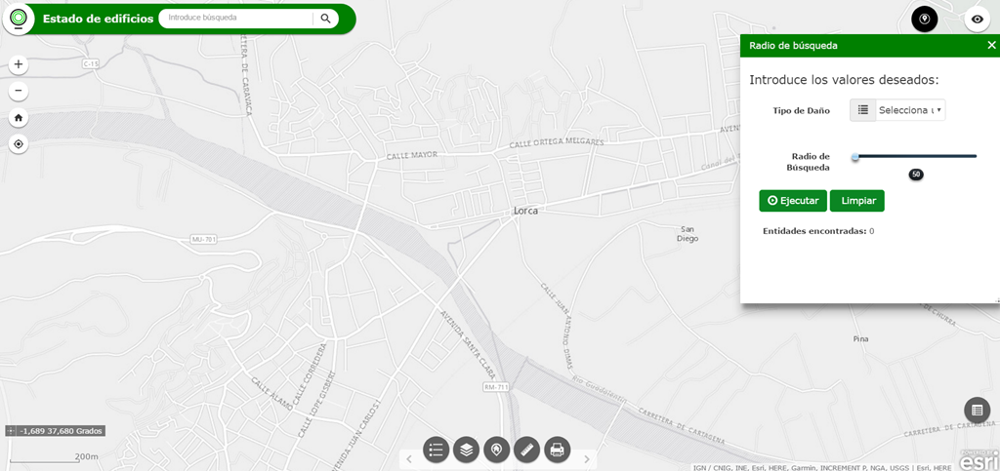](https://aicelm.github.io/Widget-RadioBusqueda/)

--

### Interfaz Usuario de Radio de búsqueda
#### HTML

* Form-group with select:

```HTML
<!-- Seleción del Grado de Daño-->

	<div class="form-group">
		<label id="tipo" class="col-md-4 control-label">Tipo de Daño</label>
			<div class="col-md-6 selectContainer">
			<div class="input-group">
					<span class="input-group-addon"><i class="glyphicon glyphicon-list"></i></span>
			<select id ="query" class="form-control selectpicker" >
				<option value="0" >Selecciona un tipo de daño</option>
				<option value= "Completo">Completo</option>
				<option value = "Extenso">Extenso</option>
				<option value= "Moderado">Moderado</option>
				<option value= "Leve">Leve</option>
			</select>
		</div>
```

--

* Form-group with range slider input :

```HTML
<!-- Selección del radio-->

<div class="form-group">
		<label id="radio" class="col-md-4 control-label">Radio de Búsqueda</label>
			<div class="col-md-6 inputGroupContainer">
			<div>
					<div id="slider">
						<input class="bar" type="range" id="distance" value="50" step="50" max="500" min="50" onchange="rangevalue.value=value" />
						<output id="rangevalue">50</output>
					</div>
			</div>
		</div>
</div>
```

--

#### HTML
##### Botones:

* Ejecutar y Limpiar

```HTML
<!-- Buttons -->
<div class="col-md-12">
	<button class="btn btn-primary" data-dojo-attach-event="onclick:play"><span class="glyphicon glyphicon-play-circle"></span> Ejecutar </button>
	<button class="btn btn-primary" data-dojo-attach-event="onclick:clear"><span class="glyphicon glyphicon-stop-circle"></span> Limpiar </button>
</div>
  ....

```

--

#### HTML
##### Texto:

* Entidades encontradas
```HTML
<div class="col-md-12" id="display">
	<strong>Entidades encontradas: </strong><span class="stats" id="countResult"></span><br>
</div>
```

--

#### HTML
##### Texto:

* Mensajes
```HTML
<!-- Mesajes y errores -->
<div class="col-md-12">
	<div id="next"></div>
	<div id="error"></div>
</div>
```

--

### Interfaz Usuario de Radio de búsqueda
#### JAVASCRIPT

Ciclo de vida del widget

```JavaScript

	onOpen: function() {
		...
	},
	onClose: function() {
		...
	}
```

--


#### JAVASCRIPT

* **OnOpen**:  Añadimos todas las variables que utilizaremos a lo largo del widget


```JavaScript
//Init widget
onOpen: function() {

		//variables
		window.$app = {
				qBuild: this.qBuild,
				qtBuild: this.qtBuild,
				distance: this.distance,
				damage: this.damage,
				map: this.map,
				graphicLayer: this.graphicLayer,
				click: this.click,
				stadtisctisDefinition: this.statisticDefinition
		};
},
```

--

#### JAVASCRIPT

* **OnClose**: Limpiamos el mapa y hacemos que deje de ejecutarse cualquier función. Coincide además con la función **Limpiar**.

```JavaScript
//Close widget
onClose: function() {
	window.$app.graphicLayer.clear();
	window.$app.map.graphics.clear();
	window.$app.click.remove();

	document.getElementById('error').classList.remove('error');
	dom.byId("rangevalue").value = 50;
	dom.byId("distance").value = 50;
	dom.byId("query").value =0;
	dom.byId('countResult').innerHTML = 0;
}

	```

--

#### JAVASCRIPT

Otras funciones definidas que corresponden a los botones:
* Función de **Ejecutar**
* Función de **Limpiar** (como la función OnClose)

```JavaScript

play: function() {
 	...
     },
clear: function() {
	 ...
	 },

```

--

#### JAVASCRIPT
###### Función play:

Creamos la **Query** y **QuerTask**, donde configuramos que valores queremos que se muestren.


```JavaScript
 window.$app.map.graphics.clear();

 //Create Query and QuerTask
 window.$app.qtBuild = new QueryTask("https://localhost:6443/arcgis/rest/services/Edificios/edificios/FeatureServer/0");
 window.$app.qBuild = new Query();

 //Search configuration
 window.$app.qBuild.outFields = ["*"];
 window.$app.qBuild.returnGeometry = true;

 window.$app.damage = dom.byId("query").value;
 window.$app.qBuild.where = "NB_GradoDaño = '" + window.$app.damage + "'";
 window.$app.distance = dom.byId("distance").value;
 window.$app.graphicLayer = new GraphicsLayer();
 window.$app.map.addLayer(window.$app.graphicLayer);

```

--

#### JAVASCRIPT
###### Función play:

Llamamos al **evento click** en el mapa y creamos la simbología. Ejecutamos la QueryTask.

```JavaScript
	 //Click event
 	window.$app.click = window.$app.map.on("click", function (evt) {

 			var text1 = document.getElementById('next');
 			text1.classList.remove("next");
 			while (text1.firstChild) {
 					text1.removeChild(text1.firstChild);
 			}

 			//Create circle
 			var circle = new Circle({
 					center: evt.mapPoint,
 					radius: window.$app.distance
 			});

 			// Configurate geometry search
 			window.$app.qBuild.geometry = circle;
 			window.$app.qBuild.spatialRelationship = Query.SPATIAL_REL_INTERSECTS;
 			var symbol = new SimpleFillSymbol(SimpleFillSymbol.STYLE_SOLID, null, new Color([0.3, 0.3, 0.3, 0.2]));
 			var gr = new Graphic(circle, symbol);

 			window.$app.graphicLayer.clear();
 			window.$app.graphicLayer.add(gr);

 			//Execute QueryTask
 			window.$app.qtBuild.execute(window.$app.qBuild, show);
 	});

```

--

#### JAVASCRIPT
###### Función play:

Llamamos a la **función show**, donde damos la simbología a cada resultado.

```JavaScript
//Create show function to show the results of QueryTask
function show(fsResult) {

		var features = fsResult.features;
		window.$app.map.graphics.clear();

		if (features.length != 0) {
				if (window.$app.damage === "Completo") {
						var fillsymbol = new SimpleFillSymbol(SimpleFillSymbol.STYLE_SOLID, new SimpleLineSymbol(SimpleLineSymbol.STYLE_SOLID, new Color([1.0, 1.0, 1.0]), 1.5), new Color("#0c0c0c"));
				} else if (window.$app.damage === "Extenso") {
						var fillsymbol = new SimpleFillSymbol(SimpleFillSymbol.STYLE_SOLID, new SimpleLineSymbol(SimpleLineSymbol.STYLE_SOLID, new Color([1.0, 1.0, 1.0]), 1.5), new Color("#de0e0e"));
				} else if (window.$app.damage === "Moderado") {
						var fillsymbol = new SimpleFillSymbol(SimpleFillSymbol.STYLE_SOLID, new SimpleLineSymbol(SimpleLineSymbol.STYLE_SOLID, new Color([1.0, 1.0, 1.0]), 1.5), new Color("#eef222"));
				} else if (window.$app.damage === "Leve") {
						var fillsymbol = new SimpleFillSymbol(SimpleFillSymbol.STYLE_SOLID, new SimpleLineSymbol(SimpleLineSymbol.STYLE_SOLID, new Color([1.0, 1.0, 1.0]), 1.5), new Color("#42e634"));
				} else if (window.$app.damage === "0") {
						var error = dom.byId("error");
						error.className = 'error';
						error.innerHTML = '<p> No se han encontrado edificios con este grado de daño en el rango de búsqueda </p>';
				}
		} else {
				var error = dom.byId("error");
				error.className = 'error';
				error.innerHTML = '<p> No se han encontrado edificios con este grado de daño en el rango de búsqueda </p>';
		}

		for (var i = 0; i < features.length; i++) {
				features[i].symbol = fillsymbol;
				window.$app.map.graphics.add(features[i]);

		var count = document.getElementById('countResult');
		count.innerHTML = features.length;
		};
};

```

--

#### JAVASCRIPT
###### Función play:

Por último dentro de la función solventamos posibles errores que puedan aparecer.

```JavaScript
var text2 = document.getElementById('error');
text2.classList.remove("error");
while (text2.firstChild) {
		text2.removeChild(text2.firstChild);
};

var text = dom.byId("next");
text.className = 'next';
text.innerHTML = '<p> Selecciona la zona de búsqueda </p>';
},

```

---

<!-- .slide: class="section" -->

## Widget de Cálculo de Seguros
[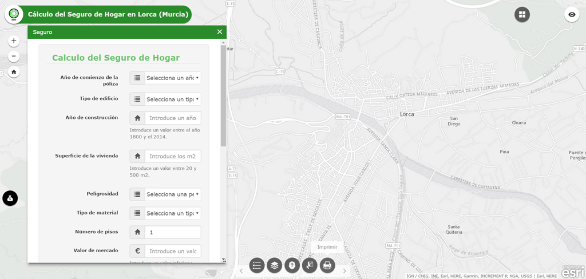](https://anmaro13.github.io/WebAppBuilder-Widgets/)

--

## Formulario Cálculo de Seguros
### Parámetros de entrada:

* Año comienzo de la poliza
* Tipo de edificio
* Año de construcción
* Superficie de la vivienda
* Peligrosidad
* Tipo de material
* Número de pisos
* Valor de mercado
* Deductible
* ¿Cobertura de objetos frágiles?
* ¿Cobertura de bienes personales?
* Valor de cobertura de bienes personales
* ¿Cobertura por inhabitabilidad temporal?
* Valor de cobertura de inhabitabilidad temporal
* ¿Es cliente nuestro?
* Tipo de seguro contratado

--

### Settings del Cálculo de Seguros

* Crear html
* getConfig (Almacenar parámetros)
* setConfig (parámetros durante setting)

--

### Settings del Cálculo de Seguros

* Interfaz de Configuración:
  - Left-Panel
  - Central-Panel

--

### Settings del Cálculo de Seguros
#### HTML

 * Left-Panel. Diferenciamos entre parámetros obligatorios y opcionales mediante un * .

```HTML
<fieldset class="well-left form-horizontal">
	<div class="form-group">
		<div class="collapse">
				<button class="btn btn-primary" data-dojo-attach-event="onclick: onClick_Descripcion" data-dojo-props="title: 'Descripción'" type="button">Descripción</button>
				<div class="panelbody" data-dojo-type="dijit/TitlePane" data-dojo-props="title: 'Parámetros de Entrada'">
						<button class="btn obli" data-dojo-attach-event="onclick: onClick_Anio">
								<label class= "control-label">Año de comienzo de la póliza</label>
						</button>
						...		 
				</div>
				<div class = "panelbody" data-dojo-type="dijit/TitlePane" data-dojo-props="title: 'Salida'">
            <button id="salida" class="btn btn-primary" data-dojo-attach-event="onclick: onClick_Salida">
                 <label class= "control-label">Capa de Salida</label>
            </button>
        </div>
			</div>
		</div>
</fieldset>

```

--

### Settings del Cálculo de Seguros
#### HTML

 * Central-Panel
 	- Interfaz de Descripción del widget

```HTML
<fieldset class="well-left form-horizontal">
	<div class="form-group" id="interfacedescription">
    <h4 class="contact-subtitle-1" id="title"><i class="fa fa-map"></i>&nbsp;   Finalidad</h4>
    <p>Cálculo del Seguro de Hogar</p>
    <h4 class="contact-subtitle-1"><i class="fa fa-file-text-o" aria-hidden="true"></i>&nbsp; Descripción</h4>
    <p>El objetivo del widget es obtener el valor de la prima de Seguro de Hogar anual, teniendo en cuenta el factor de peligrosidad
    de los edificios ante una catástrofe natural </p>
  </div>
	...
</fieldset>
```

--

### Settings del Cálculo de Seguros
#### HTML

* Central-Panel
	- Interfaces de los parámetros de entrada.

--

### Settings del Cálculo de Seguros
#### HTML

* Central-Panel/Parámetro Obligatorio

```HTML
<fieldset class="well-left form-horizontal">
	<div class="form-group" id="interfaceanio">
      <label class="col-md-6 control-label">Etiqueta: </label>
      <div class="col-md-6 inputGroupContainer">
          <div class="input-group">
              <input class="form-control" type="text" data-dojo-attach-point="insyear">
          </div>
      </div>
      <label class="col-md-6 control-label">Información: </label>
      <div class="col-md-6 inputGroupContainer">
          <div class="input-group">
              <input class="form-control" type="text" data-dojo-attach-point="infoinsyear">
          </div>
      </div>
      <label  class="col-md-6 control-label">Valor Predeterminado:</label>
      <div class="col-md-6 inputGroupContainer">
          <div class="input-group">
              <select class="form-control selectpicker" data-dojo-attach-point="valueinsyear">
                  <option value="0" >Selecciona un año</option>
                  <option value= "2015">2015</option>
                  <option value = "2016">2016</option>
                  <option value= "2017">2017</option>
              </select>
          </div>
        </div>
    </div>
 ...
</fieldset>
```

--

### Settings del Cálculo de Seguros
#### HTML

* Central-Panel/Parámetro Opcional

```HTML
<fieldset class="well-left form-horizontal">
	<div class="form-group" id="interfacetemporal">

			...

			<label class="col-md-6 control-label">Visible: </label>
			<div class="col-md-6 inputGroupContainer">
					<div class="input-group">
						 <div class="onoffswitch">
								<input type="checkbox" name="onoffswitch" class="onoffswitch-checkbox" id="visitempo" data-dojo-attach-point="visibletemp" checked hidden>
								<label class="onoffswitch-label" for="visitempo"><span class="onoffswitch-inner"></span><span class="onoffswitch-switch"></span></label>
								</div>
						</div>
				</div>
				<label class="col-md-6 control-label">Valor Predeterminado: </label>
				<div class="col-md-6 inputGroupContainer move">
						<div class="input-group">
								<div class="radio-inline">
										<label>
												<input type="radio" name="inhabitabilidad" id = "temporal" value="true" data-dojo-attach-event="onclick:temporal" data-dojo-attach-point="covtempo"/> Si
										</label>
								</div>
								<div class="radio-inline">
										<label>
											<input type="radio" name="inhabitabilidad" id = "temporal1" value="false" data-dojo-attach-event="onclick:temporal" checked data-dojo-attach-point="covtemporal"/> No
										</label>
								</div>
							</div>
					</div>
					<label class="col-md-6 control-label">Valor de la cobertura: </label>
					<div class="col-md-6 inputGroupContainer">
							<div class="input-group">
									<select name="temporal" class="form-control selectpicker" id="coberturetemporal" disabled data-dojo-attach-point="valuetemporalcoverage">
											 <option value="0" >Selecciona un valor</option>
											 <option value="1000">1.000€</option>
											 <option value="5000">5.000€</option>
											 <option value="10000">10.000€</option>
											 <option value="20000">20.000€</option>
									</select>
							</div>
					</div>
	</div>
 ...
</fieldset>
```

--

### Settings del Cálculo de Seguros
#### JAVASCRIPT

Ciclo de vida del widget

```JavaScript

	postCreate: function() {
		...
	},
	startup: function() {
		...
	},
	onOpen: function() {
		...
	},
	onClose: function() {
		...
	}
```

--

### Settings del Cálculo de Seguros
#### JAVASCRIPT

* config.json

* Funciones a destacar dentro de la configuración del widget
  * postCreate
	* setConfig. Inicializa la configuración del widget
	* getConfig. Devuelve los parámetros establecidos en la configuración

--

### Settings del Cálculo de Seguros
#### JAVASCRIPT

* config.json

```Json
{
  "iyear": "Año comienzo de poliza",
  "infoiyear": "Año en que comienza la póliza de tu seguro",
  "valueiyear": "2016",
	...
	},
```

--

### Settings del Cálculo de Seguros
#### JAVASCRIPT

* postCreate

```JavaScript
postCreate: function() {
      this.setConfig(this.config);
    },
```

--

### Settings del Cálculo de Seguros
#### JAVASCRIPT

* setConfig

```JavaScript
setConfig: function(config) {

	this.insyear.value = config.iyear;
  this.infoinsyear.value = config.infoiyear;
  this.valueinsyear.value = config.valueiyear;
	...
	},
```

--

### Settings del Cálculo de Seguros
#### JAVASCRIPT

* getConfig

```JavaScript
getConfig: function() {

	return {
        iyear: this.insyear.value,
        infoiyear: this.infoinsyear.value,
        valueiyear: this.valueinsyear.value
				...
			},
	...
	},
```

--

### Settings del Cálculo de Seguros
#### JAVASCRIPT

* getConfig

```JavaScript
getConfig: function() {

	var clientetextobjectButton= document.getElementById("visiclient");
      if(clientetextobjectButton.checked){
            this.visiblecliente.value = "optional7";
            var visiblecli = this.visiblecliente.value;
        }else{
          this.visiblecliente.value = "optional8";
          var visiblecli = this.visiblecliente.value;
        }

	return {
				clientetext: this.clientecoverage.value,
				infocliente: this.infoclientecoverage.value,
				client: visiblecli
				...
			},
	...
	},
```

--

### Settings del Cálculo de Seguros
#### JAVASCRIPT

* getConfig

```JavaScript
getConfig: function() {

	var ClienteButtons= document.getElementsByName("cliente");
        if(ClienteButtons[0].value==="true"){
            if(ClienteButtons[0].checked){
              this.covclien.value = "checked";
              this.covcliente.value = " ";
              var cli = this.covclien.value;
              var clie = this.covcliente.value;
            }
        }
        if(ClienteButtons[1].value==="false"){
            if(ClienteButtons[1].checked){
              this.covclien.value = " ";
              this.covcliente.value = "checked";
              var cli = this.covclien.value;
              var clie = this.covcliente.value;
            }
        }

	return {
				clientetext: this.clientecoverage.value,
				infocliente: this.infoclientecoverage.value,
				client: visiblecli,
				clien: cli,
				cliente: clie
				...
			},
	...
	},
```

--

### Settings del Cálculo de Seguros
#### JAVASCRIPT

* Otras Funciones definidas
 - Funciones para habilitar/deshabilitar campos en función de otros:
 			- bienes
			- temporal
			- cliente
 - Funciones para modificar la interfaz de Central-Panel:
 			- onClick_Descripcion
			- onClick_Anio
			- onClick_Edificio
			- onClick_Construccion
			- onClick_Superficie
			- onClick_Peligrosidad
			- onClick_Material
			- onClick_Pisos
			- onClick_Mercado
			- onClick_Deductible
			- onClick_Objetos
			- onClick_Personales
			- onClick_Temporal
			- onClick_Cliente


--

### Interfaz Usuario del Cálculo de Seguros
#### HTML

* Form-group with select:

```HTML
<!-- Año de Poliza-->

 <div class="form-group">
		<label class="col-md-6 control-label" title="${config.infoiyear}">${config.iyear}</label>
		<div class="col-md-6 selectContainer">
			<div class="input-group">
				<span class="input-group-addon"><i class="glyphicon glyphicon-list"></i></span>
				<select name="poliza" id ="anio" class="form-control selectpicker" title="${config.valueiyear}" >
						<option value="0" >Selecciona un año</option>
						<option id="2015" value="2015">2015</option>
						<option id="2016" value="2016">2016</option>
						<option id="2017" value="2017">2017</option>
				</select>
			</div>
		</div>
 </div>  
```

--

* Form-group with text type input :


```HTML
<!-- Año construccion-->

	<div class="form-group">
		 <label class="col-md-6 control-label" title="${config.infocyear}">${config.cyear}</label>
		 <div class="col-md-6 inputGroupContainer">
				<div class="input-group">
					<span class="input-group-addon"><i class="glyphicon glyphicon-home"></i></span>
					<input name="anio" id ="construccion" placeholder="Introduce un año" max="2014" min="1800" class="form-control" type="text" pattern="/[1][8|9][0-9][0-9]|[2][0][1][4]/" value="${config.valuecyear}">
				</div>
				<p class="help-block">${config.helpcyear}</p>
			</div>
	</div>
```

--

* Form-group with radio type input:


```HTML
<!-- Cobertura objetos fragiles -->

  <div class="form-group" id="${config.visobj}">
     <label class="col-md-6 control-label" title="${config.infoobject}">${config.objecttext}</label>
      <div class="col-md-6">
         <div class="radio-inline">
              <label>
                  <input type="radio" name="objetos" id="objetos" ${config.object} value="true" /> Si
              </label>
          </div>
          <div class="radio-inline">
              <label>
                  <input type="radio" name="objetos" id="objetos1" ${config.objection} value="false"/> No
              </label>
          </div>
      </div>
  </div>
```

--

### Interfaz Usuario del Cálculo de Seguros
#### HTML
##### Botones:

* Siguiente

```HTML
<!-- Button -->
	<div class="form-group">
			<label class="col-md-6 control-label">
				 <div></div>
			</label>
			<div class="col-md-6">
					<button id="next" class="btn btn-primary" data-dojo-attach-event="onclick:change"><span class="glyphicon glyphicon-play-circle"></span> Siguiente
					</button>
			</div>
	</div>
  ....
```

--

* Anterior & Ejecutar

```HTML
<!-- Button -->
	<div class="form-group">
			<label class="col-md-6 control-label">
         <div></div>
      </label>
			<div class="col-md-6">
					<button id="before" class="btn btn-primary" data-dojo-attach-event="onclick:change"><span class="glyphicon glyphicon-play-circle"></span> Anterior
					</button>
					<button id="hotspotButton" class="btn btn-primary" data-dojo-attach-event="onclick:calcularseguro"><span class="glyphicon glyphicon-play-circle"></span> Ejecutar </button>
			</div>
	</div>
```

--

### Interfaz Usuario del Cálculo de Seguros
#### JavaScript

Ciclo de vida del widget

```JavaScript

	postCreate: function() {
		...
	},
	startup: function() {
		...
	},
	onOpen: function() {
		...
	},
	onClose: function() {
		...
	}
```

--

### Interfaz Usuario del Cálculo de Seguros
#### JavaScript

Startup: Creamos el Geoproceso

```JavaScript
   	startup: function() {
			var gpServiceUrl = "https://localhost:6443/arcgis/rest/services/Aseguradora/GPSeguros/GPServer/ScriptEdificios";
		    this.gp = new Geoprocessor(gpServiceUrl);

	      ...
    	},
```

--

### Interfaz Usuario del Cálculo de Seguros
#### JavaScript

OnOpen:  Ocultamos la capa total de edifcios
OnClose: Hacemos visible la capa total de edificios

```JavaScript
		onOpen: function(){
			var share = this.map.getLayer("Edificios_seguro_165");
			share.hide();
		},

		onClose: function(){
			var share = this.map.getLayer("Edificios_seguro_165");
			share.show();
		},
```

--

### Interfaz Usuario del Cálculo de Seguros
#### JavaScript

Otras funciones definidas:
 * Función que define los parámetros del cálculo del seguro

	```JavaScript

 		calcularseguro:function(){
 		...
         },
	```

--

### Interfaz Usuario del Cálculo de Seguros
#### JavaScript

Otras funciones definidas:
 * Función que te permite recoger el resultado del geoproceso y pintarlo 	en el mapa
 * Función para conocer el estado del geoproceso
 * Función que en caso de que el servicio de geoproceso de error manda un mensaje alertando al usuario

 ```JavaScript

 	gpJobComplete:function(){
 	...
     },
	 gpJobStatus:function(){
	 ...
	 },
	 gpJobFailed:function(){
	 ...
	 },

 ```

--

### Interfaz Usuario del Cálculo de Seguros
#### JavaScript

Otras funciones definidas:
 * Función para hacer visible/no visible las interfaces en las que se ha dividido el formulario


 ```JavaScript

 	change:function(){
 	...
     },

```

--

### Interfaz Usuario del Cálculo de Seguros
#### JavaScript

Otras funciones definidas:
 * Función para habilitar/deshabilitar el campo correspondiente al valor de la cobertura de bienes personales en función de si deseo o no dicha covertura
 * Función para habilitar/deshabilitar el campo correspondiente al valor de la cobertura por inhabitabilidad temporal en función de si deseo o no dicha cobertura
 * Función para habilitar/deshabilitar el campo correspondiente al tipo de seguro contratado en función de si el usuario desea que el análisis se produzca en edificios donde existen clientes de la compañia.


 ```JavaScript

 	bienes:function(){
 	...
     },
	 temporal:function(){
	 ...
	 },
	 cliente:function(){
	 ...
	 },

```

--

### Interfaz Usuario del Cálculo de Seguros
#### JavaScript

Otras funciones definidas:
  * Función para limpiar los resultados dibujados en el mapa y los mensajes del estado del geoproceso


  ```JavaScript

  	cleanup:function(){
  	...
      },

  ```

--

<!-- .slide: class="end" -->

# Preguntas

---


<!-- .slide: class="questions centered" -->

## Contacto

**Andrea**
* GitHub : [anmaro13](https://github.com/anmaro13)
* Linkedin: [Andrea Martín Rodríguez](https://www.linkedin.com/in/anmaro13)

**Leticia**
* GitHub : [aicelm](https://github.com/aicelm)
* Linkedin: [Leticia Matas Álvarez](https://www.linkedin.com/in/matasalvarezleticia)
* Twitter: [aicel_m](https://twitter.com/aicel_m)

---


<!-- .slide: class="end" -->
